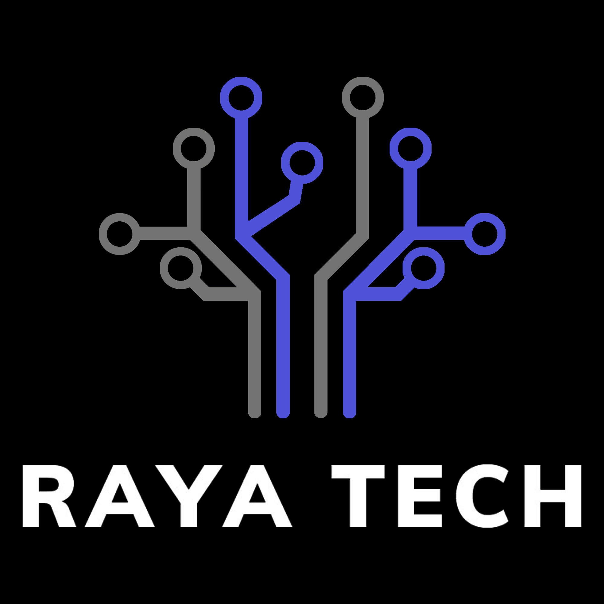

<p align="center"></p>

<p align="center"><strong>The easiest way to use Agentic RAG in any enterprise.</strong></p>

<p align="center">As simple to configure as <a href="https://openai.com/index/introducing-gpts" target="_blank">OpenAI's custom GPTs</a>, but deployable in your own cloud infrastructure using Docker. Built using <a href="https://github.com/run-llama/llama_index">LlamaIndex</a>.</p>

<p align="center">
  <a href="#get-started"><strong>Get Started</strong></a> ·
  <a href="#endpoints"><strong>Endpoints</strong></a> ·
  <a href="#deployment"><strong>Deployment</strong></a> ·
  <a href="#contact"><strong>Contact</strong></a> 
</p>

<br/>


## Get Started

To run, start a docker container with our image:

```shell
docker run -p 8000:8000 ragapp/ragapp
```

Then, access the Admin UI at http://localhost:8000/admin to configure your RAGapp.

You can use hosted AI models from OpenAI or Gemini, and local models using [Ollama](https://ollama.com/).

> _Note_: To avoid [running into any errors](https://github.com/ragapp/ragapp/issues/22), we recommend using the latest version of Docker and (if needed) Docker Compose.

## Endpoints

The docker container exposes the following endpoints:

- Admin UI: http://localhost:8000/admin
- Chat UI: http://localhost:8000
- API: http://localhost:8000/docs

> _Note_: The Chat UI and API are only functional if the RAGapp is configured.

## Security

### Authentication

RAGapp doesn't come with any authentication layer by design. You'll have to protect the `/admin` and `/api/management` paths in your cloud environment to secure your RAGapp.
This step heavily depends on your cloud provider and the services you use.
A common way to do so using Kubernetes is to use an [Ingress Controller](https://kubernetes.github.io/ingress-nginx/examples/auth/basic/).

### Authorization

Later versions of RAGapp will support to restrict access based on access tokens forwarded from an API Gateway or similar.

## Deployment

### Using Docker Compose

We provide a `docker-compose.yml` file to make deploying RAGapp with [Ollama](https://ollama.com/) and [Qdrant](https://qdrant.tech/) easy in your own infrastructure.

Using the `MODEL` environment variable, you can specify which model to use, e.g. [`llama3`](https://ollama.com/library/llama3):

```shell
MODEL=llama3 docker-compose up
```

If you don't specify the `MODEL` variable, the default model used is `phi3`, which is less capable than `llama3` but faster to download.

> _Note_: The `setup` container in the `docker-compose.yml` file will download the selected model into the [`ollama`](./ollama/) folder - this will take a few minutes.

#### Specify the Ollama host

Using the `OLLAMA_BASE_URL` environment variables, you can specify which Ollama host to use.
If you don't specify the `OLLAMA_BASE_URL` variable, the default points to the Ollama instance started by Docker Compose (`http://ollama:11434`).

If you're running a local Ollama instance, you can choose to connect it to RAGapp by setting the `OLLAMA_BASE_URL` variable to `http://host.docker.internal:11434`:

```shell
MODEL=llama3 OLLAMA_BASE_URL=http://host.docker.internal:11434 docker-compose up
```

> _Note_: `host.docker.internal` is not available on Linux machines, you'll have to use `172.17.0.1` instead. For details see [Issue #78](https://github.com/ragapp/ragapp/issues/78).

#### GPU acceleration

Using a local Ollama instance is necessary if you're running RAGapp on macOS, as Docker for Mac does not support GPU acceleration.

To enable Docker access to NVIDIA GPUs on Linux, [install the NVIDIA Container Toolkit](https://docs.nvidia.com/datacenter/cloud-native/container-toolkit/latest/install-guide.html).

### Kubernetes

It's easy to deploy RAGapp in your own cloud infrastructure. Customized K8S deployment descriptors are coming soon.

## Development

```shell
poetry install --no-root
make build-frontends
make dev
```

> _Note_: To check out the admin UI during development, please go to http://localhost:3000/admin.

## Contact

Questions, feature requests or found a bug? [Open an issue](https://github.com/ragapp/ragapp/issues/new/choose) or reach out to [marcusschiesser](https://github.com/marcusschiesser).

## Star History

[](https://star-history.com/#ragapp/ragapp&Date)
